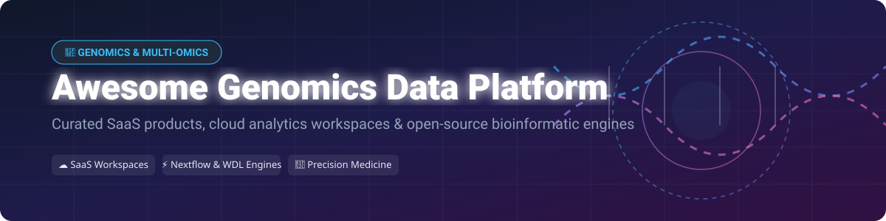

# Awesome Genomics Data Platform 🧬💻

  

  
  
  
  
  

## 🌟 Overview & Market Ecosystem

Welcome to the **Awesome Genomics Data Platform** repository! 🚀 This is a curated index of enterprise **SaaS biomedical analysis workspaces**, cloud bioinformatics platforms, and top **open-source genomic workflow engines**.

### 📊 Market Size & Structure
> [!NOTE]
> The global **Genomics Data Management & Analytics Market** is estimated at **$4.8 Billion USD (2025/2026)** and is projected to reach **$12.5+ Billion USD by 2032** growing at a CAGR of ~15%.
> 
> The market sector is **moderately fragmented**: Next-generation sequencing (NGS) hardware & primary instrument data delivery are concentrated under market leaders like Illumina and Thermo Fisher, whereas secondary analysis workflow engines, tertiary clinical interpretation, and multi-omics cloud platforms remain moderately fragmented across specialized SaaS enterprises (DNAnexus, Velsera, Seqera, SOPHiA GENETICS) and open-source consortium standards (Galaxy, Nextflow, Cromwell).

---

## 📋 Table of Contents
- [🏢 SaaS & Hosted Platforms](#-saashosted-platforms)
- [🔓 Open-Source GitHub Projects](#-open-source-github-projects)
- [🤝 How to Contribute](#-how-to-contribute)
- [💖 Support & Sponsorship](#-support--sponsorship)
- [📈 Star History](#-star-history)
- [⚠️ Disclaimer](#%EF%B8%8F-disclaimer)

---

## 🏢 SaaS & Hosted Platforms

| Product Name | Company Size / Valuation / Revenue | Starting Pricing Tier | Free Tier / Trial Limits | Description |
| :--- | :--- | :--- | :--- | :--- |
| **[Illumina Connected Analytics](https://www.illumina.com/)** | **~$20B+ Market Cap / $4.5B Revenue** (Illumina Inc.) | \$1.20 / iCredit (Pay-as-you-go credit bundles) | 1,000 free iCredits with new instrument / ICA enterprise onboarding (~30-day trial) | Illumina's cloud analytics environment for secondary analysis, data management, and instrument output integration. |
| **[BaseSpace Sequence Hub](https://www.illumina.com/)** | **~$20B+ Market Cap / $4.5B Revenue** (Illumina Inc.) | \$1.00 / iCredit (iCredit consumption model) | Free Basic Tier (Up to 1 TB stored genomic data included free with Illumina sequencer account) | Illumina's sequence data management hub for direct run uploads, standard execution apps, and sharing. |
| **[Terra (Broad Institute)](https://terra.bio/)** | **Broad / Verily / Microsoft ($3B+ institutional research backing)** | \$0.04 - \$0.10 / compute hour + Google Cloud / Azure raw storage rates | \$300 free cloud credits upon Google Cloud signup (usable on Terra workspaces) | Co-developed by Broad Institute, Verily & Microsoft for WDL/GATK pipelines, Jupyter/RStudio notebooks, and major consortia. |
| **[SOPHiA GENETICS](https://www.sophiagenetics.com/)** | **~$250M+ Market Cap / $65M+ Annual Revenue** (NASDAQ: SOPH) | \$150 - \$300 / analyzed clinical case sample | 14-Day evaluation environment / sample demo workflow upon institutional request | Data-driven medicine platform combining genomic analysis, AI predictive algorithms, and clinical diagnostic reporting. |
| **[DNAnexus](https://www.dnanexus.com/)** | **~$600M+ Valuation / $150M+ Total Funding** | \$250 / month base organization account + AWS/Azure usage rates | 14-Day Free Trial (Includes \$125 in free compute & storage credit) | Enterprise precision-health data platform for governed genomic data, CWL/WDL workflows, interactive notebooks, and biobank cohorts. |
| **[Seven Bridges / Velsera](https://www.sevenbridges.com/)** | **~$400M+ Private Valuation (Acquired by Velsera)** | \$0.06 / core-hour compute + standard cloud storage tariffs | 30-Day Free Trial / \$300 free credits on Cancer Genomics Cloud (CGC) powered by Seven Bridges | Bioinformatics platform with deep oncology and multi-omics capabilities, CWL support, and major cloud research deployments. |
| **[Seqera Platform](https://seqera.io/)** | **~$150M+ Valuation / $22M+ Series A Funding** | \$15 / user / month (Community/Pro Tier) | Free Forever Community Edition (Up to 5 workspace users & 100 pipeline runs/month) | Nextflow-centric orchestration and control plane for running scalable pipelines across cloud, hybrid, and HPC clusters. |
| **[Fabric Genomics](https://fabricgenomics.com/)** | **~$100M+ Valuation / $50M+ Venture Funding** | \$50 - \$120 / panel case (Volume tiering) | 30-Day institutional trial with 5 free test patient variant files (VCFs) | Clinical genomic interpretation and variant reporting platform for diagnostic laboratories and precision-medicine centers. |
| **[Genialis](https://www.genialis.com/)** | **~$30M+ Valuation / $10M+ Funding** | \$500 / month research team plan | 14-Day Free Research Trial (Up to 10 RNA-seq samples uploaded & analyzed) | Biomedical data analysis platform focused on RNA-seq expression and multi-omics biomarker discovery for translational research. |
| **[PrecisionFDA](https://precision.fda.gov/)** | **US Federal Government Funded (FDA / HHS)** | **100% Free** (Government / Academic research portal) | Free Forever for registered bioinformatics research users (FDA sponsored cloud allocation) | FDA's collaborative platform for evaluating bioinformatics pipelines, benchmarking variant callers, and regulatory science. |

---

## 🔓 Open-Source GitHub Projects

Below are top open-source workflow engines, bioinformatic repositories, and data platform frameworks sorted by GitHub_Stars ⭐:

- **[Nextflow](https://github.com/nextflow-io/nextflow)**   
  *Open-source workflow system for scalable, reproducible scientific pipelines, with first-class container (Docker/Singularity) and cloud support.*

- **[Snakemake](https://github.com/snakemake/snakemake)**   
  *Python-based workflow management system widely used in bioinformatics for reproducible, data-driven pipelines and automated execution.*

- **[Galaxy](https://github.com/galaxyproject/galaxy)**   
  *Premier open-source, web-based platform for accessible, reproducible biomedical data analysis with thousands of integrated tools.*

- **[nf-core](https://github.com/nf-core/tools)**   
  *Community collection of high-quality, peer-reviewed Nextflow pipelines for genomics, transcriptomics, and multi-omics analysis.*

- **[Bioconductor (BiocManager)](https://github.com/Bioconductor/BiocManager)**   
  *Open-source R infrastructure for statistical analysis and comprehension of high-throughput genomic data.*

- **[Cromwell](https://github.com/broadinstitute/cromwell)**   
  *Open-source Execution Engine for WDL (Workflow Description Language), designed for scalability from local machines to AWS/GCP (core of Broad Terra).*

- **[cBioPortal](https://github.com/cBioPortal/cbioportal)**   
  *Open-source web platform for interactive exploration of multidimensional cancer genomics data sets.*

- **[IGV (Integrative Genomics Viewer)](https://github.com/igvteam/igv.js)**   
  *Embeddable JavaScript component for high-performance visual exploration of genomic datasets and BAM/VCF alignments.*

- **[samtools / htslib](https://github.com/samtools/htslib)**   
  *C library for high-throughput sequencing data formats (BAM, CRAM, VCF, BCF), foundational to almost all genomic data platforms.*

- **[Dockstore](https://github.com/dockstore/dockstore)**   
  *GA4GH compliant open platform for sharing Docker-based tools and workflows (WDL, CWL, Nextflow) across Terra, Galaxy, and cloud environments.*

- **[WARP (Broad Institute pipelines)](https://github.com/broadinstitute/warp)**   
  *Open-source, production-grade, cloud-optimized WDL pipelines for large-scale genomics consortia tuned for Cromwell and Terra.*

- **[GA4GH Schema & API Specifications](https://github.com/ga4gh/schemas)**   
  *Global Alliance for Genomics and Health open standards for interoperable genomic data exchange, workflow execution (WES), and DRS object storage.*

---

## 🛠️ Frameworks for Building Custom Genomics Data Platforms
1. **Pipeline Execution Layer**: Write modular pipelines using [Nextflow](https://github.com/nextflow-io/nextflow) or [Snakemake](https://github.com/snakemake/snakemake) / WDL ([Cromwell](https://github.com/broadinstitute/cromwell)).
2. **Workflow Discovery & Registry**: Share containerized pipelines via [Dockstore](https://github.com/dockstore/dockstore) or [nf-core](https://github.com/nf-core/tools).
3. **Data Management & Web UI**: Deploy [Galaxy](https://github.com/galaxyproject/galaxy) or [cBioPortal](https://github.com/cBioPortal/cbioportal) for end-user web access and interactive visual analysis with [IGV.js](https://github.com/igvteam/igv.js).
4. **Interoperability APIs**: Adhere to GA4GH standards (Data Repository Service DRS, Workflow Execution Service WES) for multi-cloud data governance.

---

## 🤝 How to Contribute

Contributions are highly appreciated! To contribute:
1. Fork this repository 🍴
2. Create a new feature branch (`git checkout -b feature/new-genomics-platform`)
3. Add your entry following the tabular format for SaaS or star-badged format for Open Source
4. Submit a Pull Request with a short summary of the product/tool 🚀

---

## 💖 Support & Sponsorship

If you find this curated genomics list valuable for your research, lab, or organization, please consider supporting the project:

- ⭐ **Star this repository** to show appreciation and increase visibility!
- 🔀 **Fork & Share** with colleagues, bioinformaticians, and computational biologists.
- ☕ **Buy me a coffee / Sponsor**: Support ongoing maintenance on GitHub Sponsors:  
  👉 **[Sponsor on GitHub](https://github.com/sponsors/ishandutta2007)** 💖

Thank you to all bioinformaticians, researchers, and open-source contributors pushing precision medicine forward! 🙏

---

## 📈 Star History

---

## ⚠️ Disclaimer

- This repository is a **community-curated list** for informational and educational purposes only — it does not constitute an endorsement.
- Genomics data platforms handle highly sensitive human genetic data. Compliance (HIPAA, GDPR, CAP/CLIA validation) and security posturing are critical. Open-source tools require appropriate cloud security configuration before handling patient data.

---

  <b>Made for bioinformaticians, genomic researchers, and precision-medicine engineering teams. 🧬✨</b>

